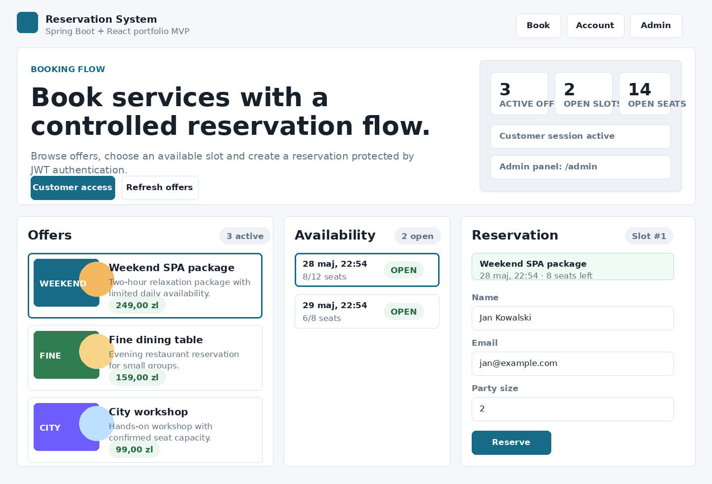
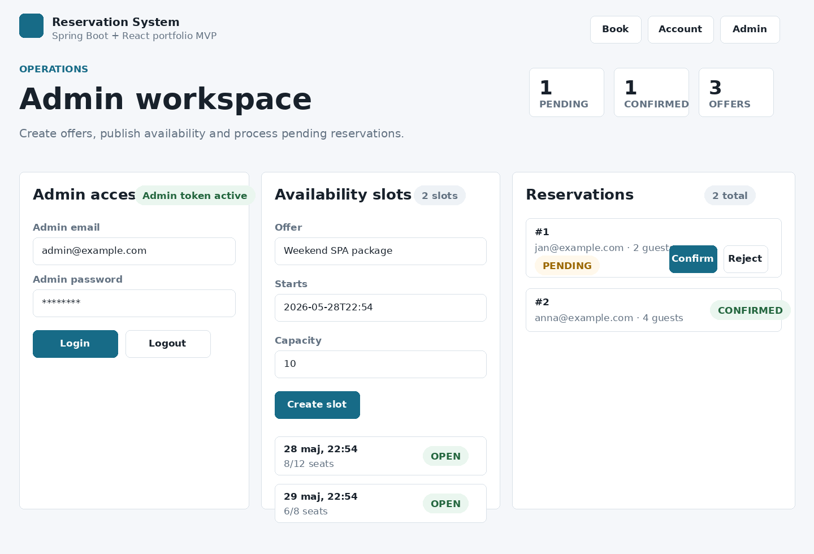

# Reservation System

Spring Boot backend and React frontend for a reservation system. The current
MVP contains tested backend modules for auth, offers, availability slots and
reservations. The frontend provides a customer booking flow and an admin
workspace for creating offers/slots and processing reservations.

The project is intentionally still a portfolio MVP. It keeps H2 for fast
local/test runs, and also has a PostgreSQL/Flyway/Docker Compose development
path plus JWT authentication for protected backend endpoints.

## Current Status

- Java 21
- Spring Boot 4.0.6
- Maven
- Spring Web MVC
- Spring Data JPA
- Bean Validation
- H2 for current local/dev/test setup
- PostgreSQL dev profile with Flyway migrations
- Docker Compose for local PostgreSQL
- Spring Security with JWT bearer tokens for protected endpoints
- Auth module with customer registration, login and password change
- OpenAPI UI through Springdoc in the `dev` profile
- React 19 + Vite + TypeScript frontend

Current Maven modules:

```text
reservation/security-common
reservation/auth
reservation/offer
reservation/availability
reservation/booking
```

Frontend app:

```text
frontend
```

## Documentation

- Final project direction: [docs/final-project-design.md](docs/final-project-design.md)
- Offer V1 plan: [docs/offer-module-v1-plan.md](docs/offer-module-v1-plan.md)
- Implemented MVP API: [docs/api-contract.md](docs/api-contract.md)
- Current architecture decision: [docs/mvp-architecture.md](docs/mvp-architecture.md)

## Frontend Preview

Customer booking flow:



Admin workspace:



## Build And Test

Run the full reactor from the aggregator:

```bash
cd reservation
mvn test
```

Run a focused module with its dependencies:

```bash
mvn test -pl booking -am
```

Run a single test class:

```bash
mvn -pl booking -Dtest=ReservationServiceTest test
```

Run a single test method:

```bash
mvn -pl booking -Dtest=ReservationServiceTest#createReservation_reservesAvailabilitySlotAndSavesReservation test
```

Build all modules:

```bash
mvn clean package
```

Build the frontend:

```bash
cd frontend
npm install
npm run build
```

## Run Locally

Run one module with the default H2 profile as an executable Spring Boot jar:

```bash
cd reservation
mvn -pl booking -am -DskipTests package
java -jar booking/target/booking-0.0.1-SNAPSHOT-exec.jar
```

The `-am` flag builds required module dependencies first. The executable jar
uses the `exec` classifier so the plain module jar remains usable as a Maven
dependency by other modules.

Default module ports:

```text
offer:        http://localhost:8080
availability: http://localhost:8081
booking:      http://localhost:8082
auth:         http://localhost:8083
```

Run the frontend development server:

```bash
cd frontend
npm install
npm run dev
```

The Vite dev server starts on:

```text
http://localhost:5173
```

Admin panel is served from the same frontend under:

```text
http://localhost:5173/admin
```

For a portfolio/demo preview without running the backend modules, enable the
frontend mock API:

```bash
cd frontend
VITE_USE_MOCK_API=true npm run dev
```

During local development the frontend proxies API traffic through these
prefixes, so the backend modules should be running on their default ports:

```text
/offer-api        -> http://localhost:8080
/availability-api -> http://localhost:8081
/booking-api      -> http://localhost:8082
/auth-api         -> http://localhost:8083
```

For the complete browser flow across all four backend apps, run the modules
against the shared PostgreSQL database with `--spring.profiles.active=dev-postgres`.
The default H2 setup is useful for isolated module work, but each app gets its
own in-memory database, so data created through `availability` is not shared
with `booking`.

Frontend auth defaults can be overridden with `VITE_CUSTOMER_EMAIL`,
`VITE_CUSTOMER_PASSWORD`, `VITE_ADMIN_EMAIL`, `VITE_ADMIN_PASSWORD` and
`VITE_USE_MOCK_API`.

Swagger UI is enabled in the `dev` profile and disabled in default/test/prod:

```text
http://localhost:<port>/swagger-ui.html
```

H2 console is enabled in the `dev` profile:

```text
http://localhost:<port>/h2-console
```

## Run With PostgreSQL

Start local PostgreSQL:

```bash
cd reservation
docker compose up -d postgres
```

Build the modules:

```bash
mvn -DskipTests package
```

Run a module with Flyway migrations and PostgreSQL:

```bash
java -jar booking/target/booking-0.0.1-SNAPSHOT-exec.jar --spring.profiles.active=dev-postgres
```

The default local PostgreSQL settings are:

```text
url:      jdbc:postgresql://localhost:5432/reservation
username: reservation
password: reservation
```

They can be overridden with `DATABASE_URL`, `DATABASE_USERNAME` and
`DATABASE_PASSWORD`.

Production-style runs with `--spring.profiles.active=prod` also require
`JWT_SECRET`. Optional JWT settings are `JWT_ISSUER` and `JWT_EXPIRATION`.
The auth module can seed an admin only when `AUTH_ADMIN_SEED_ENABLED=true`; in
that case set `AUTH_ADMIN_PASSWORD` explicitly.

Default local auth data:

```text
admin seed in dev/dev-postgres: admin@example.com / admin123
customer accounts: registered through POST /api/v1/auth/register
```

## Smoke Test

The booking module has a dev-only seed availability slot, and the auth module
can issue a JWT accepted by booking when both apps use the same JWT settings.
The same flow works with `dev-postgres`.

Build auth and booking:

```bash
cd reservation
mvn -pl auth,booking -am -DskipTests package
```

Start auth with the `dev` profile:

```bash
java -jar auth/target/auth-0.0.1-SNAPSHOT-exec.jar --spring.profiles.active=dev
```

Start booking with the `dev` profile in another terminal:

```bash
java -jar booking/target/booking-0.0.1-SNAPSHOT-exec.jar --spring.profiles.active=dev
```

Register and log in a customer, then put the returned `token` into
`CUSTOMER_TOKEN`:

```bash
curl -i -X POST http://localhost:8083/api/v1/auth/register \
  -H "Content-Type: application/json" \
  -d '{
    "displayName": "Jan Kowalski",
    "email": "jan@example.com",
    "password": "customer123"
  }'
```

```bash
curl -X POST http://localhost:8083/api/v1/auth/login \
  -H "Content-Type: application/json" \
  -d '{
    "email": "jan@example.com",
    "password": "customer123"
  }'
```

Create a reservation:

```bash
curl -i -X POST http://localhost:8082/api/v1/reservations \
  -H "Authorization: Bearer $CUSTOMER_TOKEN" \
  -H "Content-Type: application/json" \
  -d '{
    "availabilitySlotId": 1,
    "customerName": "Jan Kowalski",
    "customerEmail": "jan@example.com",
    "partySize": 2
  }'
```

```bash
curl -i -H "Authorization: Bearer $CUSTOMER_TOKEN" http://localhost:8082/api/v1/reservations/1
```

```bash
curl -i -X DELETE -H "Authorization: Bearer $CUSTOMER_TOKEN" http://localhost:8082/api/v1/reservations/1
```

For the full endpoint list and examples, see
[docs/api-contract.md](docs/api-contract.md).

## Current API Summary

Auth:

```text
POST   /api/v1/auth/register
POST   /api/v1/auth/login
POST   /api/v1/auth/change-password
```

Offer:

```text
GET    /api/v1/offers
GET    /api/v1/offers/{offerId}
GET    /api/v1/admin/offers
POST   /api/v1/admin/offers
PATCH  /api/v1/admin/offers/{offerId}
DELETE /api/v1/admin/offers/{offerId}
```

Availability:

```text
GET    /api/v1/offers/{offerId}/availability
POST   /api/v1/admin/offers/{offerId}/availability
PATCH  /api/v1/admin/availability/{slotId}
DELETE /api/v1/admin/availability/{slotId}
```

Booking:

```text
POST   /api/v1/reservations
GET    /api/v1/reservations/{reservationId}
GET    /api/v1/reservations?customerEmail=...
GET    /api/v1/admin/reservations
GET    /api/v1/admin/availability/{slotId}/reservations
DELETE /api/v1/reservations/{reservationId}
```

Auth login issues JWTs. Password change requires a bearer token. Admin endpoints
require a bearer token with the `ADMIN` role, booking reservation endpoints
require `CUSTOMER` or `ADMIN`, and public offer/availability read endpoints
remain unauthenticated. Customers can access only reservations matching the
email from their token; admins can access all reservations.

## MVP Architecture

The current backend should be treated as a modular Spring Boot MVP with four
separate runnable modules. Booking directly depends on the availability module
and uses its JPA entity/repository to reserve and release slot capacity in one
transaction.

This is acceptable for the current MVP and tests. If the project evolves into
separate production microservices, booking must stop directly using
availability repositories and switch to an HTTP/event/contract boundary.

## Current Verification

Latest local full reactor result:

```text
mvn test
security-common: 9 tests
auth:            29 tests
offer:           46 tests
availability:    76 tests
booking:         82 tests, 2 skipped locally when Docker is unavailable
BUILD SUCCESS

npm run build
frontend TypeScript and Vite production build
BUILD SUCCESS
```
