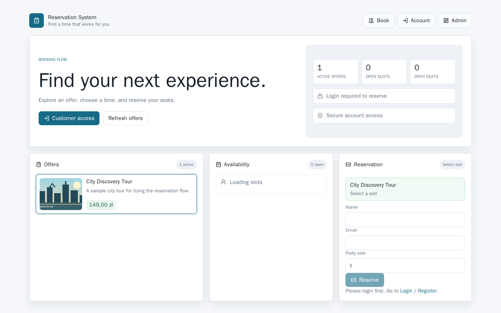
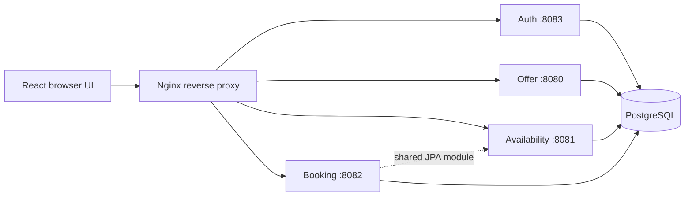

# Reservation System Rebuild

A full-stack reservation portfolio project: customers browse offers, register, reserve seats, and cancel; administrators create offers and slots, then confirm or reject reservations. The browser UI uses the real Spring Boot API and PostgreSQL in the default Docker setup.



## Run the complete app

Requirements: Docker Engine with the Compose plugin. From the repository root:

```bash
./start-demo.sh
```

Open **http://localhost:8088**. The script builds the React frontend and four Java services, starts PostgreSQL, waits for health checks, creates a sample tour and availability slot, and generates random passwords in the ignored local `.env` file. Sign in as `jan@example.com` (customer) or `admin@example.com` (administrator) with the matching password from `.env`. Do not commit `.env`.

```bash
./start-demo.sh stop     # stop containers, preserve database
./start-demo.sh update   # rebuild and start again
./start-demo.sh reset    # delete the local demo database after typing RESET
```

The demo binds the frontend to `127.0.0.1` by default. `FRONTEND_PORT=8090 ./start-demo.sh` changes the port. A separate Compose project can be selected with `COMPOSE_PROJECT_NAME`.

## Architecture


```mermaid
flowchart LR
  Browser[React browser UI] --> Proxy[Nginx reverse proxy]
  Proxy --> Auth[Auth :8083]
  Proxy --> Offer[Offer :8080]
  Proxy --> Availability[Availability :8081]
  Proxy --> Booking[Booking :8082]
  Auth --> DB[(PostgreSQL)]
  Offer --> DB
  Availability --> DB
  Booking --> DB
  Booking -. shared JPA module .-> Availability
```

All API calls go through same-origin paths `/auth-api`, `/offer-api`, `/availability-api`, and `/booking-api`. Auth issues JWTs. Customer reservation operations check the token email; admin operations require the admin role. Booking updates reservations and slot capacity in one database transaction. `@Version` protects concurrent slot updates; conflicts return HTTP 409. Flyway owns the PostgreSQL schema. The booking and availability modules share Java persistence code in this MVP; they are separate processes but not independent microservices.

## Check the project

```bash
cd reservation
offer/mvnw -f pom.xml -B test
```

The complete Maven suite uses PostgreSQL Testcontainers for concurrency and restart checks, so Docker access is required. The latest local run passed **249 tests, 0 failures, 0 skipped**.

```bash
cd frontend
npm ci
npm run build
```

Use Node 22 for the frontend. With the complete demo running, run desktop and mobile Chromium tests using the pinned Playwright image:

```bash
docker run --rm --ipc=host --network host -v "$PWD/..:/work" -w /work/frontend mcr.microsoft.com/playwright:v1.64.0-noble npm run test:e2e
```

The latest local run passed **12 browser tests** covering the booking lifecycle, session expiry, authorization, a stale-capacity conflict, reconciliation after a lost write response, API outage, and form validation. GitHub Actions runs the Java suite, frontend build, PostgreSQL smoke check, and real API browser tests. A Python smoke test is also available with `python3 scripts/smoke-real-api.py` from the repository root.

## Measurements and documentation

- [Performance report and reproduction steps](docs/performance.md) — HTTP p50/p95, throughput, errors, CPU/RAM/DB samples, and query plans.
- [API contract](docs/api-contract.md).
- [Architecture decisions](docs/mvp-architecture.md).
- [Portfolio summary and project tradeoffs](docs/portfolio.md).
- [Admin workspace screenshot](docs/screenshots/admin-workspace.png).
- [Mobile booking screenshot](docs/screenshots/mobile-booking.png).

## Local development

The frontend is in `frontend/` (React, TypeScript, Vite). `npm run dev` starts it on port 5173 and proxies API calls to backend ports 8080–8083. `VITE_USE_MOCK_API=true npm run dev` enables an isolated UI preview. The default H2 profile is useful for single-module development; the complete cross-module browser flow uses shared PostgreSQL.

Java 21, Spring Boot 4, Maven, Spring Security, JPA, Flyway, PostgreSQL 16, React 19, TypeScript, Playwright, and Docker Compose are used in this repository. The public HTTPS demo and release link will be added after deployment.
